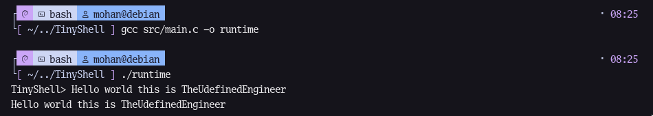

# TinyShell – Development Log

## Day 1 – Input Handling

### What I learned
- fgets() reads the entire line including spaces
- It keeps the newline character `\n`
- Must remove newline before processing commands

### New functions used
- fgets()
- strcspn()

### Mistakes I made
- Tried to run a directory instead of an executable
- Confused project folder name with binary name

### Key insight
A shell must never call exec() directly, or it will replace itself.

### Result

